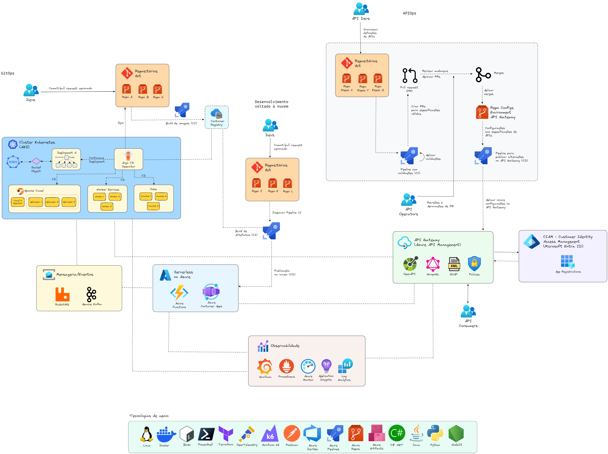

# ArquiteturaIntegracoes-2025-01
Apresentação sobre Arquitetura de Integrações realizada no dia 30/01/2025.

Tecnologias e tópicos abordados: **Kubernetes, Docker, Azure DevOps, APIOps, GitOps, Linux, Azure, Apache Camel...**

---

## Arquitetura de referência

